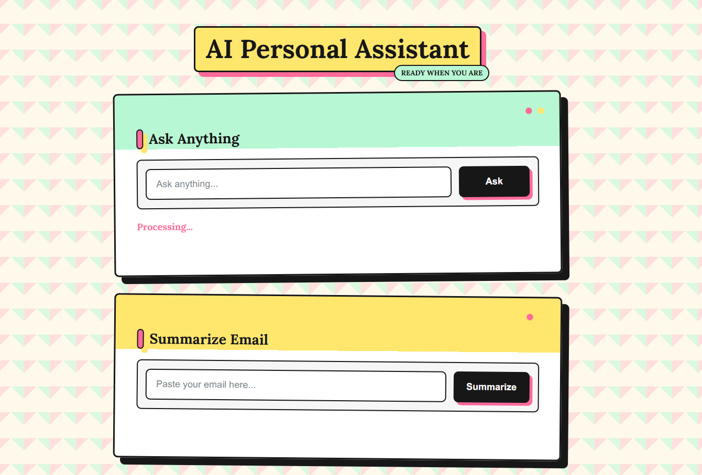

# AI Personal Assistant

A Flask-based AI assistant powered by Gemini. It can answer questions, summarize emails, and summarize uploaded PDF documents from one colorful web interface.

## Screenshot

### Home Page



## Features

- Ask questions and get AI-generated answers
- Summarize long email text into short, clear points
- Upload a PDF document and generate a document summary
- Separate panels for each assistant task
- Colorful neo-brutalist user interface
- Loading messages while requests are processing
- API key stored safely in a `.env` file

## Tech Stack

- Python
- Flask
- Google Gemini API
- HTML
- CSS
- JavaScript
 
## Folder Structure

```text
AI-Assistant/
|__ main.py
|-- README.md
|-- requirements.txt
|-- assets/
       |-- Homepage.png
|-- static/
       |-- style.css
|-- templates/
        |-- index.html
```

## Installation

### 1. Clone the repository

```bash
git clone https://github.com/AdarshBhoutekar/AI-Personal-Assistant.git
cd AI-Personal-Assistant
```

### 2. Create a virtual environment

```bash
python -m venv .venv
```

### 3. Activate the virtual environment

Windows PowerShell:

```powershell
.\.venv\Scripts\Activate.ps1
```

macOS/Linux:

```bash
source .venv/bin/activate
```

### 4. Install dependencies

```bash
pip install -r requirements.txt
```

### 5. Add your Gemini API key

Create a `.env` file in the project root:

```env
GEMINI_API_KEY=your_gemini_api_key_here
```

### 6. Run the application

```bash
python main.py
```

Open this URL in your browser:

```text
http://127.0.0.1:5000
```

## How It Works

The app has three main actions:

```text
/ask                 -> answers user questions
/summarize           -> summarizes pasted email text
/summarize-document  -> summarizes an uploaded PDF file
```

For PDF summarization, the browser uploads the PDF file. Flask reads the uploaded file bytes and sends them to Gemini.

## Environment Variables

| Name | Description |
| --- | --- |
| `GEMINI_API_KEY` | Your Google Gemini API key |

## Important Note

Do not upload your `.env` file to GitHub. It contains your secret API key.
